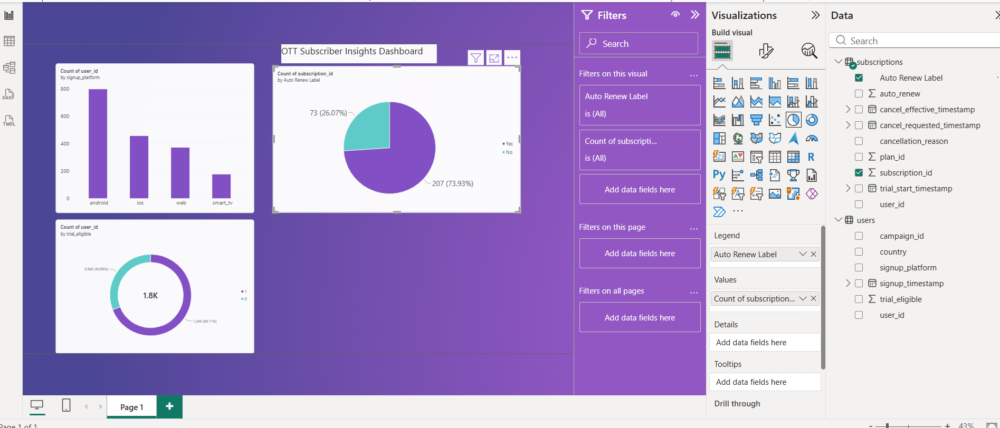

# OTT Subscriber Analytics — Funnel, Retention & Experimentation

End-to-end analysis of an OTT (streaming) subscriber dataset — from a 13-table
MySQL schema through funnel/cohort/A-B-test analysis in SQL, to an interactive
Power BI dashboard.



## What this project covers

- **Database design**: 13-table relational schema in MySQL, loaded and
  validated an 18-month synthetic dataset (1,800 users, 122K+ events) with
  zero data loss against expected row counts.
- **Funnel & retention analysis**: signup → paid conversion funnel and
  monthly cohort retention. Caught a right-censoring bias that was
  falsely inflating recent-cohort retention to 100%, and corrected it by
  restricting the analysis to fully-observed cohort windows.
- **A/B test audit**: reviewed a trial-length experiment, found ~100 users
  with cross-variant contamination and excluded them, then tested the
  result with a two-proportion z-test (Control 80.2% vs Treatment 81.4%,
  z ≈ 0.38) — result was **not statistically significant**, recommended
  against shipping.
- **Payment-failure-recovery analysis**: diagnosed a join fan-out bug that
  was producing impossible (>100%) recovery rates, fixed it with a
  correlated `EXISTS` subquery, and identified `card_declined` (67.9%
  recovery) as the weakest-recovery segment — proposed a "Smart Retry"
  feature to target it.
- **Power BI dashboard**: connected the same source data (CSV) into Power
  BI, corrected an auto-detected 1:1 relationship to the correct 1:many
  (a user can have multiple subscription rows), and built an interactive
  dashboard covering signup platform mix, auto-renew split, and trial
  eligibility.

## Dashboard highlights

| Metric | Finding |
|---|---|
| Signup platform | Android is the top signup channel, followed by iOS, Web, then Smart TV |
| Auto-renew | 73.93% of subscriptions have auto-renew on, 26.07% off |
| Trial eligibility | 69.11% of the 1,800 users are trial-eligible, 30.89% are not |

*(Figures above are from this project's own dataset — re-verify against the
live `.pbix`/query output before quoting them elsewhere.)*

## Tools used

- **MySQL** — schema design, CTEs, window functions, correlated subqueries
- **Power BI** — Power Query (data cleaning), data modeling (relationships,
  cardinality), DAX measures, interactive slicer-driven dashboard

## Repo structure

```
ott-subscriber-analytics/
├── README.md
├── schema/               # schema.sql + query files (funnel, cohort, A/B test, fan-out fix)
├── data/                 # source CSVs (or a sample, if the full set is large)
├── Power_Bi/
│   └── OTT_Dashboard.pbix
└── Screenshots/
    └── dashboard.png
```

## How to explore this project

1. Run the schema file in `schema/` against a MySQL instance, then load `data/`.
2. Run the queries in `schema/` in order — each is commented with what
   it does and what it found.
3. Open `Power_Bi/OTT_Dashboard.pbix` in Power BI Desktop to explore the
   interactive dashboard.

---
*Built as a self-directed learning project while transitioning from QA/Automation into Product Analyst / BA roles.*
